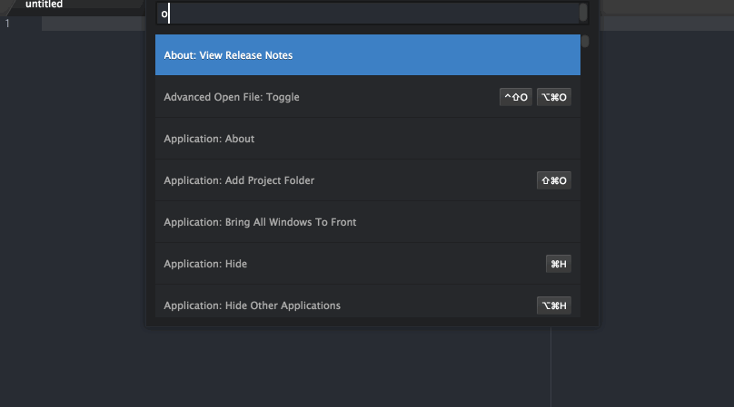

# open-package
Select and open a installed package's code in Atom.

## Usage
Command: `open-package:toggle`

You can select a package like the builtin Command Palette.

## License
Apache License, Version 2.0
